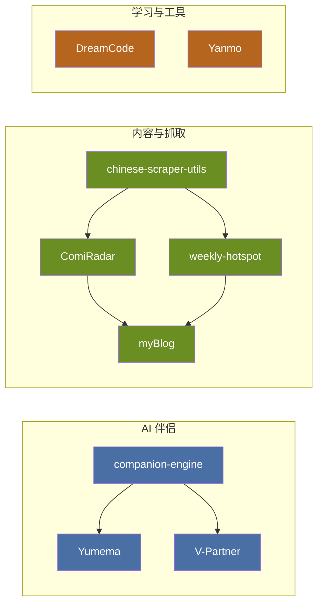

# 梦夜十六 · DreamNight

**code for life, build for fun.**

---

## 项目生态 / Project Ecosystem

### AI 伴侣 / AI Companion

| Project | Description | Package |
|---------|-------------|---------|
| [companion-engine](https://github.com/sixtdreanight/companion-engine) | 核心引擎，驱动所有 AI 伴侣应用 / Core engine for AI companion apps |  |
| [Yumema](https://github.com/sixtdreanight/Yumema) | Electron 桌面应用，基于 companion-engine / Electron desktop app | |
| [V-Partner](https://github.com/sixtdreanight/V-Partner) | CLI + QQ 机器人，基于 companion-engine / CLI & QQ bot | |

### 内容与抓取 / Content & Scraping

| Project | Description | Package |
|---------|-------------|---------|
| [chinese-scraper-utils](https://github.com/sixtdreanight/chinese-scraper-utils) | 通用爬虫工具库 / Shared scraping utilities |  |
| [ComiRadar](https://github.com/sixtdreanight/ComiRadar) | 动漫事件雷达，驱动博客 events 页面 / Anime event radar | |
| [weekly-hotspot](https://github.com/sixtdreanight/weekly-hotspot) | 每周热点深度分析，驱动博客 weekly 页面 / Weekly hot topics | |
| [myBlog](https://github.com/sixtdreanight/myBlog) | 个人博客 (Astro + React) / Personal blog | |

### 学习与工具 / Learning & Tools

| Project | Description |
|---------|-------------|
| [DreamCode](https://github.com/sixtdreanight/DreamCode) | 交互式编程入门课，让编程充满乐趣 / Interactive vibe coding course |
| [Yanmo](https://github.com/sixtdreanight/Yanmo) | 学术研究助手 (研墨) / Academic research assistant |

---

## GitHub 统计 / Stats

---

## 链接 / Links

- **博客 / Blog**: [dreamnight.net.cn](https://dreamnight.net.cn)
